# Monte_Carlo_Portfolio
A financial planner for retirement. This tool will forecast the performance of their retirement portfolio in 30 years. To do this, the tool will make an Alpaca API call via the Alpaca SDK to get historical price data for use in Monte Carlo simulations.

----------

## Technologies
This project leverages python 3.7 with the following packages:

**[Operating System Library](https://docs.python.org/3/library/os.html)** - For being able to work with our operating system.<br>
**[Requests Library](https://pypi.org/project/requests/)** - For making requests to our APIs<br>
**[JSON Library](https://www.json.org/json-en.html)** - For creating comprehensible data structures from our API responses.<br>
**[Pandas Library](https://pandas.pydata.org/)** - For use of financial functions for calculations.<br>
**[Dotenv Library](https://pypi.org/project/python-dotenv/)** - For being able to work with our .env files.<br>
**[Alpaca Trade API](https://alpaca.markets/docs/)** - For retrieving historical pricing data for our stocks.<br>
**[Monte Carlo Simulation Library](https://umn.bootcampcontent.com/SVivanco/valhalla/blob/491913853a10bb86a912f102ef3fb26746a2e6ec/code/MCForecastTools.py)** - For running Monte Carlo Simulations for our portfolio.<br>
**[Matplot Library](https://matplotlib.org/)** - For being able to plot our calculated data.

----------

## Installation Guide

Before running the application first import the following dependencies:

```python
import os
import requests
import json
import pandas as pd
from dotenv import load_dotenv
import alpaca_trade_api as tradeapi
from MCForecastTools import MCSimulation

%matplotlib inline
```

Make sure the "requests library" & the "JSON library" are included in your conda dev environment.

```python
conda list requests

conda list json
```
The result on your screen should resemble the following image:

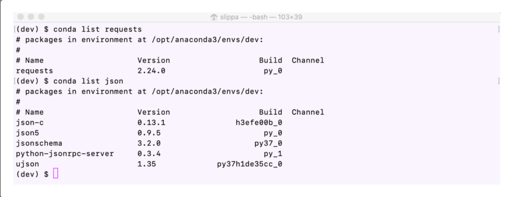

If your development environment is missing either package, you can directly install it.

To install the Requests library, check that your development environment is active, and then run the following command:

```python
conda install -c anaconda requests
```

To install the JSON library, check that your development environment is active, and then run the following command:

```python
conda install -c jmcmurray json
```

With the python-dotenv library, you can read key-value pairs from an environment file (.env) and add them as environment variables.

To install this library, run the following command in your terminal:

```python
pip install python-dotenv
```

**Install the Alpaca SDK**
Alpaca is an API for stock trading. With the Alpaca SDK, you can interact with the Alpaca API.

To install this SDK, run the following command in your terminal:

```python
pip install alpaca-trade-api
```

**Verify the Installations**
To verify that the library and SDK installations completed, call the pip list function together with the grep -E argument, which enables plain-text searches via the command line. The following code shows this function call:

```python
pip list | grep -E "python-dotenv|alpaca-trade-api"
```

The following image shows the results in your terminal:

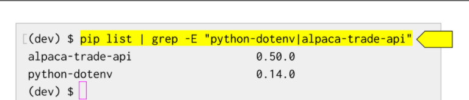

Alternatively, you can call the conda list function twice, first with the library name and then with the SDK name, as the following code shows:

```python
conda list python-dotenv

conda list alpaca-trade-api
```

The following image shows the results in your terminal:

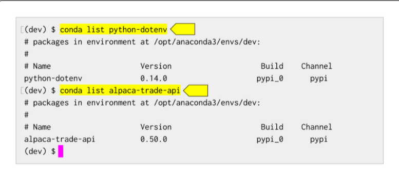

**Get the API Keys**
To use certain APIs, you need API keys. You use these unique identifiers to establish an authenticated, secure connection to an API. You'll get keys for both the Quandl and Alpaca APIs.

**Get the Quandl API Key**
To get your API key, you need to sign up for a Quandl account. Go to the Quandl homepage (Links to an external site.), and then click Sign Up (which appears on the main menu along the top of the page). The following image shows the Quandl homepage:

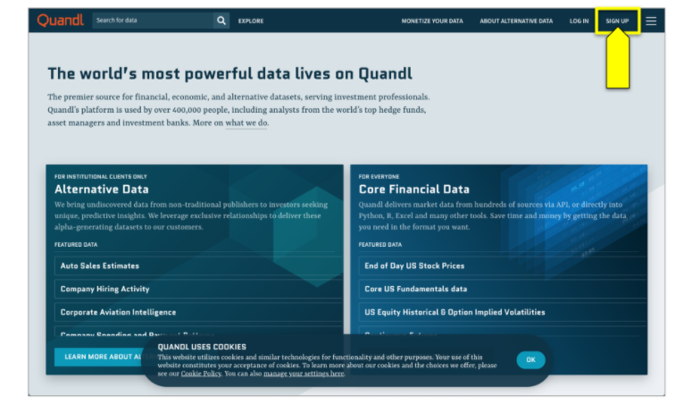

On the “Step 1 of 3” sign-up page that appears, enter your first and last names, and then select Personal as your purpose for using Quandl. Click Next to move to the next page. The following image shows the “Step 1 of 3” page:

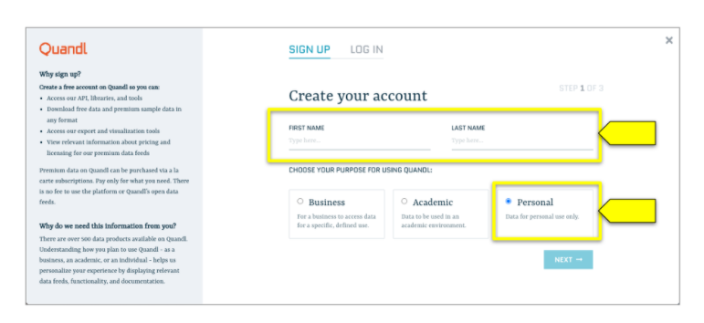

On the “Step 2 of 3” page that appears, enter your email address, and then on the “How will you be using this data” drop-down menu, select your reason for using Quandl data. We suggest selecting “For a personal software development project.” Then click Next. The following image shows the “Step 2 of 3” page:

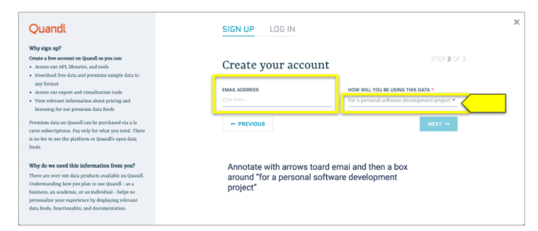

Now, set a password—you need to enter it twice—and then check the “I’m not a robot” reCAPTCHA box. Accept the terms of service and privacy policy. Finally, click Create Account. The following image shows the “Step 3 of 3” sign-up page:

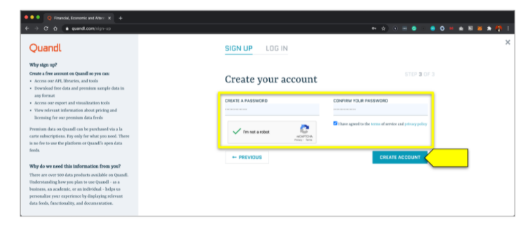

The page that appears displays a welcome message with your API key. Copy the key from the box, and then click Continue. Your new Quandl homepage appears, where you can exit the Quandl browser window. The following image shows the “Welcome to Quandl” page with your API key:

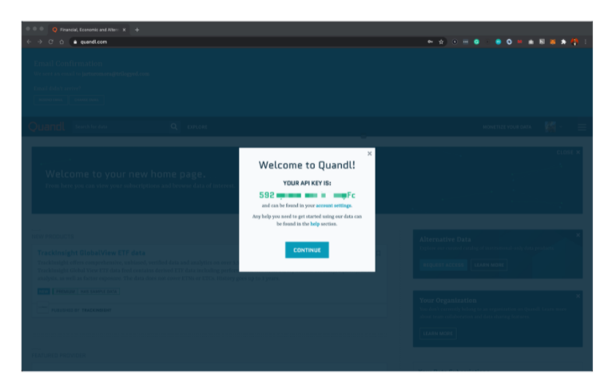

Securely store your Quandl API key on your computer so that you can access it throughout the module. We recommend storing it in either a password keeper or document that resides on your local machine. The following image shows a suggestion for the format:

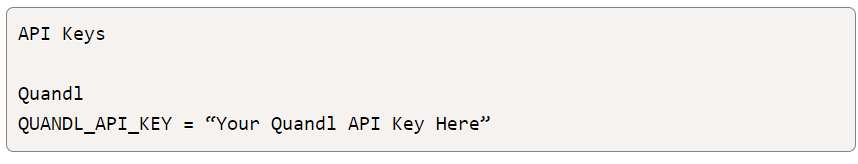

Quandl sends you a confirmation email. Open the email, and then confirm your address to avoid any issues when using this API.

You need to generate your API credentials from the Alpaca API, so go to the **[Alpaca Markets sign-up page](https://alpaca.markets/docs/)**. To create an account, enter an email address, create a 12-character password, and then click “Sign up for free.” You’ll receive an email to verify the address before you can continue. The following image shows the Alpaca Markets sign-up page:

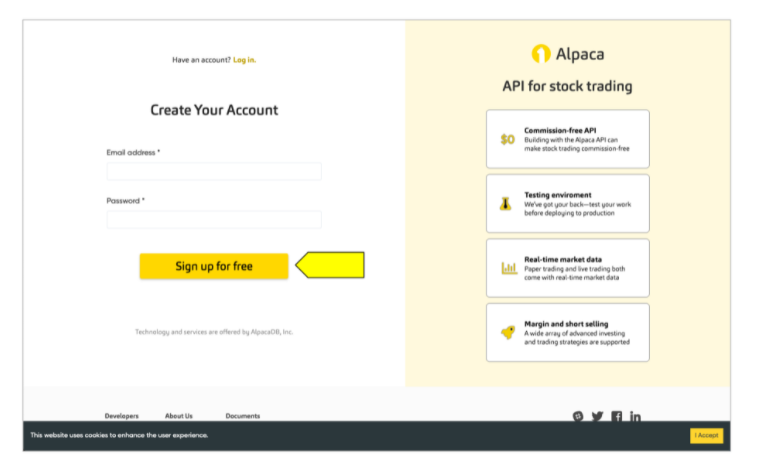

Once you verify your email address, the "Welcome to Alpaca” page displays. Click the “Go to Paper Account” link (which appears at the far left of the page). The following image shows this page:

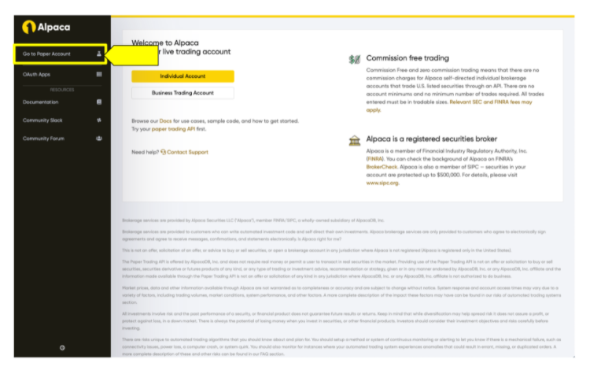

The Paper Trading page displays. In the “Your API Keys” area (which exists on the right side of the page), click the View button. Then click “Generate API Keys.” This generates two keys: the API Key ID and a secret key. The following image shows the Paper Trading page with the View button.

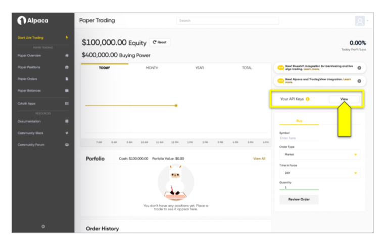

Copy both keys, and then securely store them on your computer so that you can access them throughout the module. I recommend storing them in either a password keeper or a document that you can secure—perhaps the same document where you stored the Quandl API key.

The following image shows a suggestion for the format:

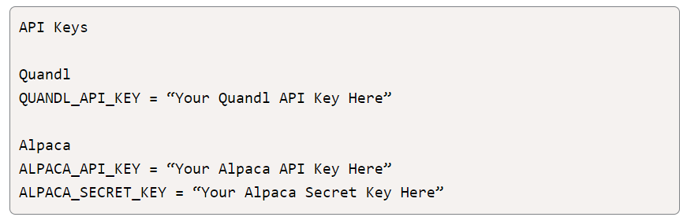

**Display Your Hidden Files**
You’ll use environment (.env) files to protect your Quandl and Alpaca API keys. When you create an environment file, the system hides it in the folder structure of the project. Thus, if you navigate the folder structure of your computer via Finder (macOS) or File Explorer (Windows), you won’t find an environment file in the project folder.

To work with environment files, you need your folder structure to display them for you. To display the hidden files on your computer, complete the steps in the following subsections.

**Windows Users: Display Your Hidden Files in File Explorer**
To display the hidden files on a Windows computer, complete the following steps:

In the search bar, type “folder”.

Click “File Explorer Options”.

In the “File Explorer Options” dialog box that displays, click the View tab. Select “Show hidden files, folders, and drives,” and then click OK, as the following image shows:

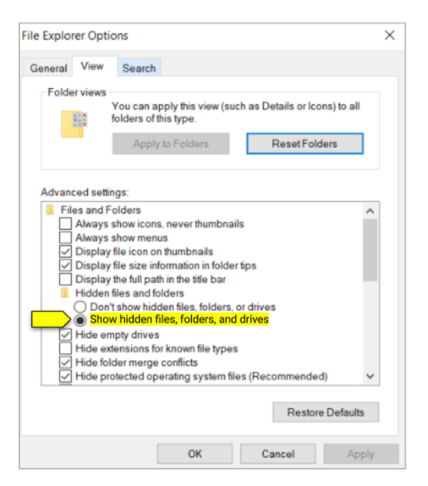

**macOS Users: Display Your Hidden Files in Finder**
To display the hidden files on a macOS computer, complete the following steps:

Open Finder.

Press the Command+Shift+Dot (.) key combination.

**Display Your Hidden Files in JupyterLab**
You can also observe your hidden files directly in JupyterLab. To do this, run the following command in the terminal when JupyterLab launches:

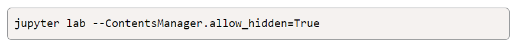

This command doesn’t permanently change the ability to observe hidden files in JupyterLab. You need to launch JupyterLab with this extended command every time you want to work with hidden files.

**Installation should now be complete**

## Usage

In order to use this program, in your terminal, make sure you are in your conda dev environment
and then from the directory you're working in launch jupyter lab. The following image shows this step:

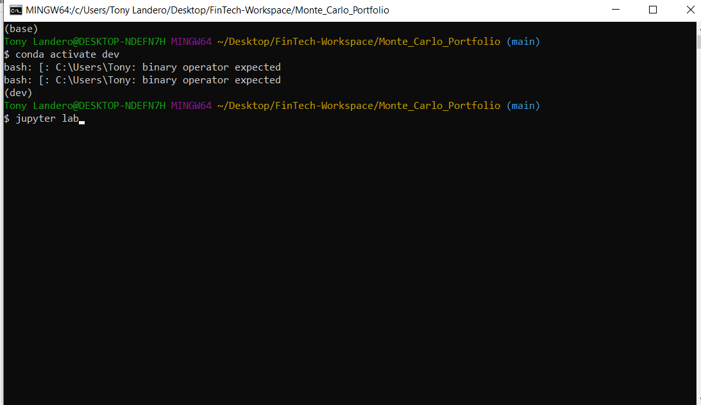

Thes result of the program should be to determine whether a person will be able to retire after only ten years. 

First, we need to calculate their current retirement plan, which is set for 30 years. However, we want to determine if rebalancing their portfolio to include heavier stock weight, will allow the client to retire after only 10 years, instead of 30 years.

The application produces two histograms and summary statistics that we can use to make our detemination on this client's retirement.

Following, are the results of the 30-year retirement calculation for the client:

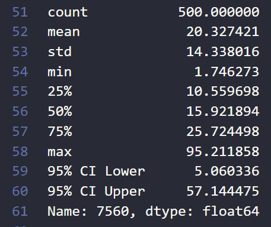

Next, the histogram showing the range that we have a 95% certainty of happening:

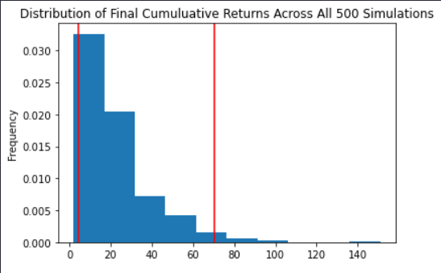

From the summary statistics and the histogram, we can tell that the average return this client will get in 30 years is right at 20 times the initial investment (current portfolio value).

Now the calculations for the 10-year retirement plan, starting with the summary statistics:

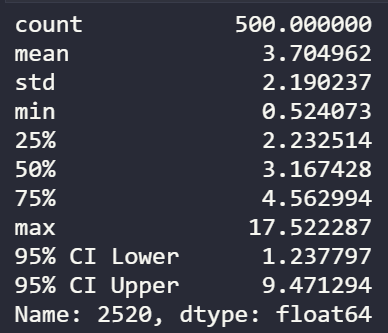

We will now plot the data in a histogram:

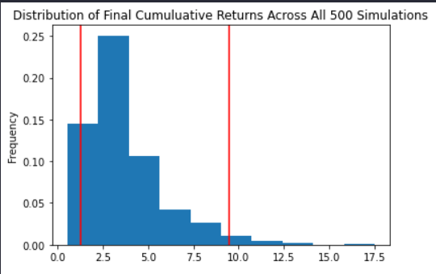

From the summary statistics and the histogram, we can tell that the average return this client will get in 30 years is right at 3.7 times the initial investment (current portfolio value).

Given only this information, we can determine that the portfolio value in 10 years will **not** be sufficient for early retirement. 

---

## Contributors

**Created by:** Tony Landero<br>
**Email Adress:** mr.landero@gmail.com

---

